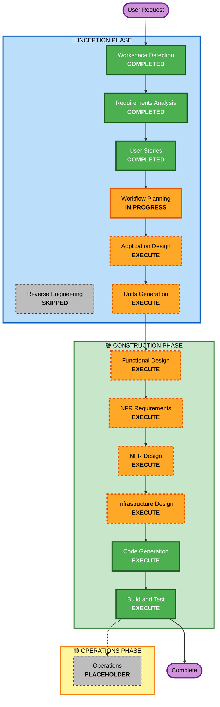

# Execution Plan

## Detailed Analysis Summary

### Project Context
- **Project Type**: Greenfield (new application)
- **Application**: ClosetMind - Women-centric smart outfit planning system
- **Architecture**: Full-stack serverless application on AWS
- **Complexity**: Moderate - Multiple integrated features with rule-based logic

### Change Impact Assessment
- **User-facing changes**: Yes - Complete new user application with 7 feature areas (authentication, wardrobe, calendar, events, suggestions, notifications, analytics)
- **Structural changes**: Yes - New serverless architecture with React frontend, Lambda backend, DynamoDB database, and AWS integrations
- **Data model changes**: Yes - New DynamoDB tables (Users, Wardrobe, Outfits, Events) with defined schemas
- **API changes**: Yes - New REST API with 15+ endpoints for all features
- **NFR impact**: Yes - Performance, security, scalability, cost optimization requirements

### Risk Assessment
- **Risk Level**: Medium
- **Rationale**: Multiple AWS services integration, weather API dependency, SMS notifications, rule-based suggestion logic
- **Rollback Complexity**: Easy (greenfield - no existing system to maintain)
- **Testing Complexity**: Moderate (unit tests + integration tests required, multiple service integrations)

---

## Workflow Visualization

---

## Phases to Execute

### 🔵 INCEPTION PHASE

#### Completed Stages
- [x] **Workspace Detection** - COMPLETED (2026-03-29T17:11:00Z)
  - Determined greenfield project with no existing code
  
- [x] **Reverse Engineering** - SKIPPED
  - Rationale: Greenfield project, no existing codebase to analyze
  
- [x] **Requirements Analysis** - COMPLETED (2026-03-29T17:13:00Z)
  - Comprehensive requirements gathered with 18 clarifying questions
  - Functional and non-functional requirements documented
  - Extension configuration determined (Security: No, PBT: Partial)
  
- [x] **User Stories** - COMPLETED (2026-03-29T17:19:00Z)
  - 24 user stories created (5 epics + 19 standard stories)
  - 2 personas defined (Priya - primary, Ananya - secondary)
  - MoSCoW prioritization applied
  
- [x] **Workflow Planning** - IN PROGRESS
  - Creating comprehensive execution plan

#### Stages to Execute

- [ ] **Application Design** - EXECUTE
  - **Rationale**: New application requiring component identification, service layer design, and component method definitions
  - **Deliverables**: 
    - Component architecture (frontend components, backend services)
    - Service layer design (authentication, wardrobe, calendar, events, suggestions, notifications, analytics services)
    - Component methods and business rules (outfit suggestion algorithm, usage tracking, reminder scheduling)
    - API contract definitions
  - **Why needed**: Multiple services with complex interactions (weather API, SNS, EventBridge, DynamoDB) require clear architectural design

- [ ] **Units Generation** - EXECUTE
  - **Rationale**: System needs decomposition into multiple units of work for parallel development
  - **Deliverables**:
    - Unit breakdown (Frontend unit, Backend API unit, Infrastructure unit)
    - Unit dependencies and interfaces
    - Unit-to-story mapping
    - Development sequence
  - **Why needed**: Full-stack application with frontend, backend, and infrastructure components that can be developed in parallel

### 🟢 CONSTRUCTION PHASE

#### Per-Unit Design Stages (Execute for Each Unit)

- [ ] **Functional Design** - EXECUTE (per unit)
  - **Rationale**: New data models, business logic, and algorithms need detailed design
  - **Deliverables**:
    - Data models (DynamoDB table schemas, entity relationships)
    - Business logic design (outfit suggestion algorithm, usage tracking, reminder logic)
    - State management (user session, wardrobe state, calendar state)
    - Validation rules
  - **Why needed**: Complex business rules (outfit suggestions based on weather, occasion, wear history) require detailed functional design

- [ ] **NFR Requirements** - EXECUTE (per unit)
  - **Rationale**: Performance, security, scalability, and cost requirements need assessment
  - **Deliverables**:
    - Performance requirements (API response times, page load times)
    - Security requirements (authentication, authorization, data protection)
    - Scalability requirements (concurrent users, data volume)
    - Cost optimization strategies (free tier usage, DynamoDB optimization)
    - Tech stack selection rationale
  - **Why needed**: AWS free tier constraints, comprehensive error handling, and responsive design requirements need explicit NFR planning

- [ ] **NFR Design** - EXECUTE (per unit)
  - **Rationale**: NFR patterns need to be incorporated into design
  - **Deliverables**:
    - Performance optimization patterns (caching, pagination, lazy loading)
    - Security implementation patterns (Cognito integration, input validation, HTTPS)
    - Scalability patterns (serverless auto-scaling, DynamoDB partition key design)
    - Error handling patterns (retry logic, graceful degradation)
  - **Why needed**: Multiple AWS services integration requires careful NFR design to meet requirements

- [ ] **Infrastructure Design** - EXECUTE (per unit)
  - **Rationale**: Infrastructure services need mapping and deployment architecture required
  - **Deliverables**:
    - AWS service mapping (Cognito, Lambda, API Gateway, DynamoDB, S3, SNS, EventBridge)
    - Deployment architecture (Amplify Hosting, SAM deployment)
    - Resource specifications (Lambda configurations, DynamoDB tables, SNS topics)
    - IAM roles and permissions
    - Environment configuration
  - **Why needed**: Serverless architecture with 8+ AWS services requires comprehensive infrastructure design

#### Always Execute Stages

- [ ] **Code Generation** - EXECUTE (ALWAYS, per unit)
  - **Part 1 - Planning**: Create detailed code generation plan with explicit steps
  - **Part 2 - Generation**: Execute approved plan to generate code, tests, and artifacts
  - **Deliverables**:
    - Frontend code (React components, pages, routing, state management)
    - Backend code (Lambda functions, API handlers, business logic)
    - Infrastructure code (SAM templates, resource definitions)
    - Unit tests and integration tests
    - Configuration files
  - **Why needed**: Implementation of all designed components and features

- [ ] **Build and Test** - EXECUTE (ALWAYS)
  - **Deliverables**:
    - Build instructions for all units
    - Unit test execution instructions
    - Integration test instructions
    - Build and test summary
  - **Why needed**: Verify all components work correctly and integrate properly

### 🟡 OPERATIONS PHASE

- [ ] **Operations** - PLACEHOLDER
  - **Rationale**: Future deployment and monitoring workflows
  - **Status**: All build and test activities handled in CONSTRUCTION phase

---

## Execution Summary

### Stages to Execute: 11 stages
1. Application Design (INCEPTION)
2. Units Generation (INCEPTION)
3. Functional Design (CONSTRUCTION, per-unit)
4. NFR Requirements (CONSTRUCTION, per-unit)
5. NFR Design (CONSTRUCTION, per-unit)
6. Infrastructure Design (CONSTRUCTION, per-unit)
7. Code Generation (CONSTRUCTION, per-unit)
8. Build and Test (CONSTRUCTION)

### Stages to Skip: 2 stages
1. Reverse Engineering - Greenfield project
2. Operations - Placeholder for future

### Estimated Timeline
- **INCEPTION Phase**: 2-3 stages remaining (Application Design, Units Generation)
- **CONSTRUCTION Phase**: Per-unit execution (3 units expected: Frontend, Backend, Infrastructure)
- **Total Estimated Duration**: Comprehensive execution with all design stages

---

## Success Criteria

### Primary Goal
Build a fully functional ClosetMind MVP that allows users to manage wardrobes, log outfits, plan events, receive suggestions, and get reminders within AWS free tier constraints.

### Key Deliverables
- React frontend with 5 pages (Login, Dashboard, Wardrobe, Calendar, Events)
- Serverless backend with 15+ API endpoints
- DynamoDB database with 4 tables
- Cognito authentication
- Rule-based outfit suggestion engine
- SMS reminder system via SNS
- Outfit usage analytics
- Comprehensive tests (unit + integration)
- Deployment configurations (Amplify + SAM)

### Quality Gates
- All user stories have corresponding implementation
- All acceptance criteria met
- Unit tests pass with adequate coverage
- Integration tests validate service interactions
- Application works on mobile and desktop (responsive)
- AWS free tier usage optimized
- Comprehensive error handling implemented
- Basic accessibility requirements met

---

**Document Version**: 1.0  
**Last Updated**: 2026-03-29T17:20:00Z  
**Status**: Ready for Review and Approval
